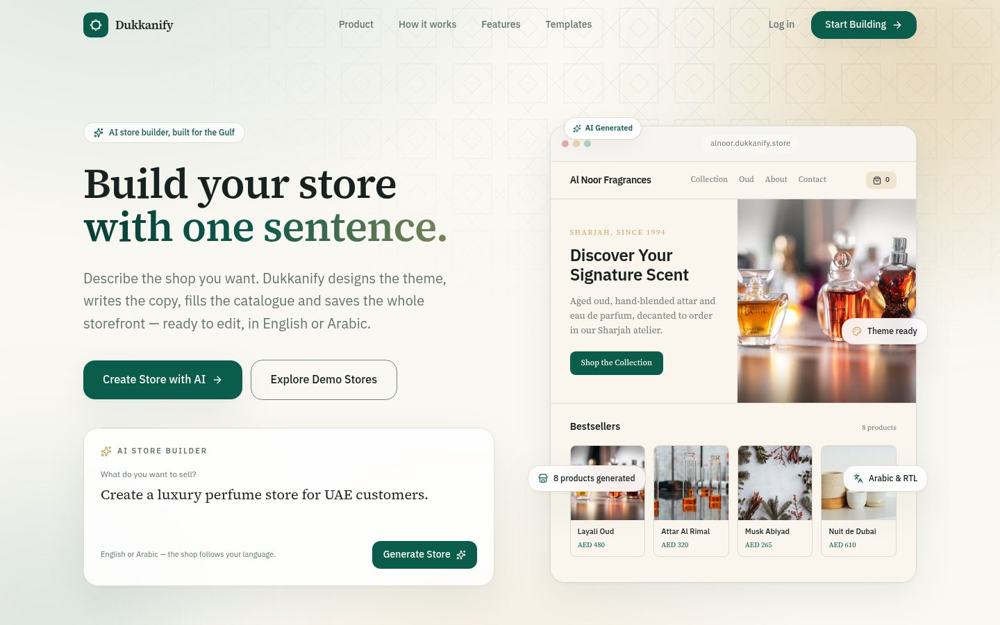
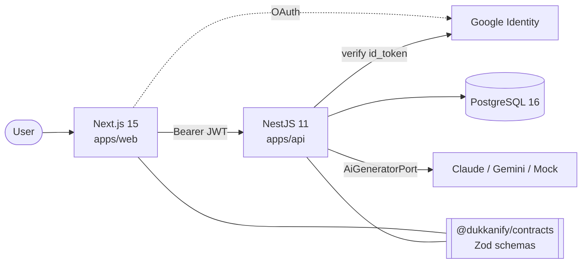
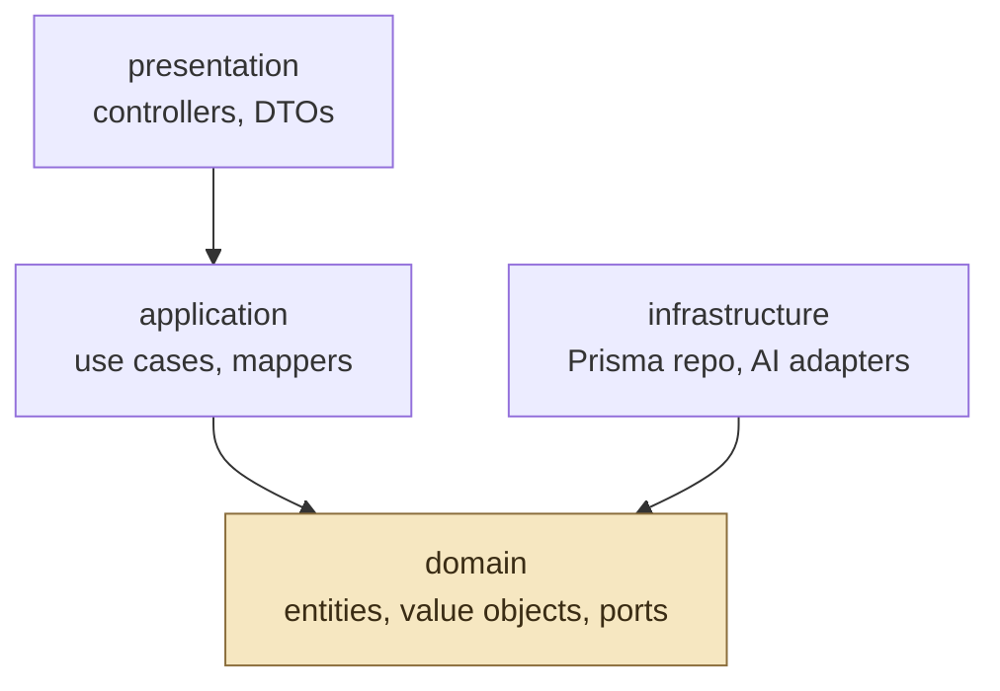
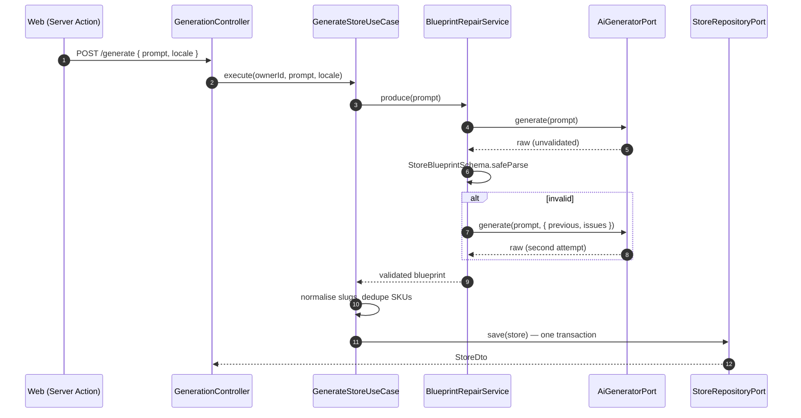
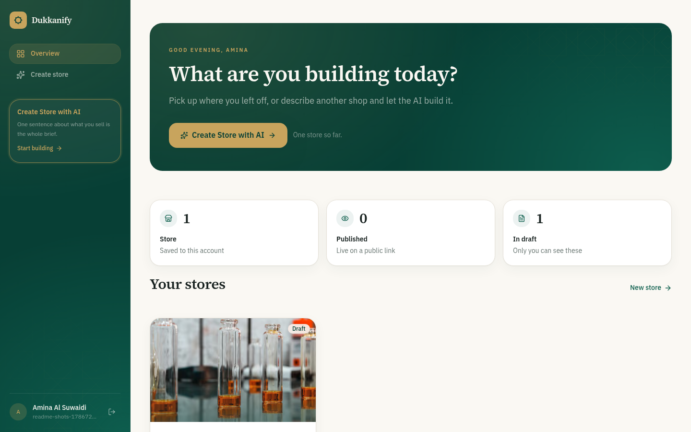
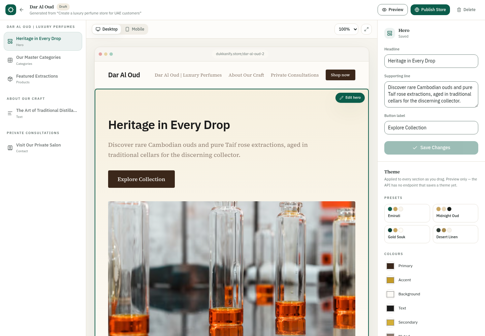
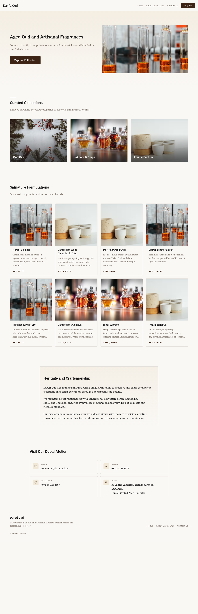
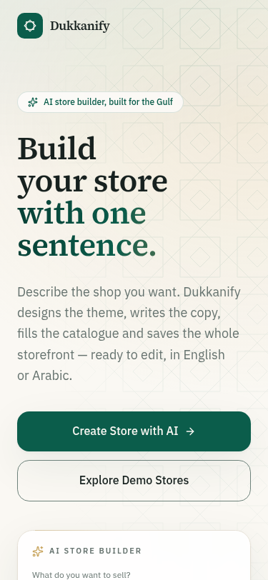

# Dukkanify — AI Store Builder

Describe a shop in one sentence and get a whole storefront: a theme, a hero, curated
categories, eight priced products, and About and Contact pages — saved to PostgreSQL,
rendered instantly, and editable in place.

> Built for the Dukkanify AI Challenge. `docs/architecture.md` is the specification this
> repository was written against; this file is how to run it and what to look at.



---

## What it does

|                       |                                                                                                                                           |
| --------------------- | ----------------------------------------------------------------------------------------------------------------------------------------- |
| **Prompt → shop**     | `"Create a luxury perfume store for UAE customers"` becomes a themed storefront with a catalogue, in about a second on the mock provider. |
| **Persisted**         | Every store, page, section, category and product is a row in PostgreSQL, written in one transaction.                                      |
| **Instant preview**   | The generated shop appears without a page refresh — a Server Action redirects into the builder client-side.                               |
| **Inline editing**    | Click a section, change its words, save. Colour pickers and theme presets repaint every section as you drag.                              |
| **Bilingual**         | Write the prompt in Arabic and the shop is stored `ar` / `RTL` and rendered right-to-left.                                                |
| **Public storefront** | `/preview/:slug` is open to anyone, carries no session, and 404s honestly for a slug nobody owns.                                         |

---

## Quick start (one command)

**Prerequisites:** Node.js **20.11+**, Docker, and (for Google sign-in) a Google OAuth client.

```bash
git clone <this-repo> && cd dukkanify
npm install
```

Copy env files once (skipped automatically on later runs if they already exist):

```bash
cp apps/api/.env.example apps/api/.env
cp apps/web/.env.local.example apps/web/.env.local
```

Fill in at least:

- `apps/api/.env` → `JWT_SECRET`, `GOOGLE_CLIENT_ID` (same Google client id)
- `apps/web/.env.local` → `AUTH_SECRET`, `AUTH_GOOGLE_ID`, `AUTH_GOOGLE_SECRET`

Then start **everything** with a single command:

```bash
npm run dev
```

That one command:

1. Starts PostgreSQL via Docker (`localhost:5433`)
2. Waits until the database is healthy
3. Applies Prisma migrations
4. Runs the API on **:4000** and the web app on **:3000** together

Open <http://localhost:3000> → **Start Building** (Google, or email and password) → **Create Store with AI**.

| Alias              | Same as                             |
| ------------------ | ----------------------------------- |
| `npm start`        | `npm run dev`                       |
| `npm run dev:apps` | API + web only (DB already running) |

`AI_PROVIDER=mock` is the default — no paid API key required. For a real model set
`AI_PROVIDER=gemini` + `GEMINI_API_KEY`, or `AI_PROVIDER=claude` + `ANTHROPIC_API_KEY`, then
restart `npm run dev`.

### Sign-in

`/signup` and `/login` accept an email and password, or **Continue with Google**. Both paths
end in the same application JWT.

For Google, create an OAuth client (Web application) in the [Google Cloud Console](https://console.cloud.google.com/)
and add this authorised redirect URI:

`http://localhost:3000/api/auth/callback/google`

Put the client id/secret in `apps/web/.env.local` (`AUTH_GOOGLE_ID` / `AUTH_GOOGLE_SECRET`) and
the **same** client id in `apps/api/.env` as `GOOGLE_CLIENT_ID`.

### Verify the checkout gates

```bash
npm run typecheck && npm run lint && npm run test && npm run build
```

---

## Configuration

| Variable                               | App | Purpose                                                                      |
| -------------------------------------- | --- | ---------------------------------------------------------------------------- |
| `DATABASE_URL`                         | api | PostgreSQL connection string                                                 |
| `PORT`, `NODE_ENV`, `CORS_ORIGIN`      | api | Server basics                                                                |
| `AI_PROVIDER`                          | api | `mock` \| `claude` \| `gemini` — selects the adapter bound to `AI_GENERATOR` |
| `ANTHROPIC_API_KEY`, `GEMINI_API_KEY`  | api | Never exposed to the browser                                                 |
| `AI_MODEL`, `AI_MAX_TOKENS`            | api | Model and output budget                                                      |
| `JWT_SECRET`, `JWT_EXPIRES_IN`         | api | Application token signing                                                    |
| `GOOGLE_CLIENT_ID`                     | api | Audience for server-side `id_token` verification                             |
| `THROTTLE_TTL`, `THROTTLE_LIMIT`       | api | Rate limiting                                                                |
| `NEXT_PUBLIC_API_URL`                  | web | API base URL — the only public variable                                      |
| `AUTH_SECRET`                          | web | Auth.js session encryption                                                   |
| `AUTH_GOOGLE_ID`, `AUTH_GOOGLE_SECRET` | web | Google OAuth client                                                          |

Every variable is validated with Zod at boot. A missing one fails startup with a named list,
not an `undefined` three layers deep at request time.

---

## Architecture



Three deployables, one shared type package. **The web app never talks to PostgreSQL or to a
model** — it only knows the API. That single rule is what keeps the AI key out of the browser
and the backend independently testable.

### The dependency rule



Arrows point inward, always. `domain/` imports nothing from `@nestjs/*`, `@prisma/client` or
any model SDK, and the claim is checked rather than asserted:

```bash
grep -rn "PrismaService\|@prisma/client\|@anthropic-ai/sdk\|@google/genai\|@nestjs/" \
  apps/api/src/modules/*/domain apps/api/src/modules/*/application
```

Zero hits, in CI on every push. That grep is the difference between a folder structure that
_looks_ like clean architecture and one that is.

### Generation pipeline



The model is asked only for what a model can invent. Ids, slugs, reading direction, positions
and money are all decided by code, because they are things code can guarantee. A blueprint
that fails the contract gets exactly **one** repair turn carrying the precise Zod issues; a
second failure is a `422` with an actionable message, never a 500.

### Data model

Seven tables — `User`, `Store`, `Page`, `Section`, `Category`, `Product`, `StoreVersion` —
with `Decimal(10,2)` money, `locale`/`direction` from the first migration, and
`@@unique([storeId, slug])` and `@@unique([storeId, sku])` enforcing per-store uniqueness.
The full ERD and every column is in [`docs/architecture.md` §6](docs/architecture.md).

---

## API

| Method   | Path                                    | Auth                 | Purpose                                             |
| -------- | --------------------------------------- | -------------------- | --------------------------------------------------- |
| `POST`   | `/api/v1/auth/google`                   | public               | Exchange a Google `id_token` for an application JWT |
| `POST`   | `/api/v1/auth/register`                 | public, 5/min/IP     | Create an account from an email and a password      |
| `POST`   | `/api/v1/auth/login`                    | public, 5/min/IP     | Exchange an email and password for the same JWT     |
| `POST`   | `/api/v1/generate`                      | required, 5/min/user | Generate and persist a store from a prompt          |
| `POST`   | `/api/v1/store`                         | required             | Persist or replace a store the client holds         |
| `GET`    | `/api/v1/store`                         | required             | List the caller's stores                            |
| `GET`    | `/api/v1/store/:id`                     | required + ownership | Full store with pages, sections, products           |
| `PATCH`  | `/api/v1/store/:id/sections/:sectionId` | required + ownership | The inline editor's write                           |
| `PATCH`  | `/api/v1/store/:id/status`              | required + ownership | Publish or return a store to draft                  |
| `DELETE` | `/api/v1/store/:id`                     | required + ownership | Delete a store the caller owns                      |
| `GET`    | `/api/v1/storefront/:slug`              | public               | Published storefront render data                    |
| `GET`    | `/api/v1/health`                        | public               | Liveness + database connectivity                    |

Every response is wrapped as `{ data, meta }`; every error as
`{ error: { code, message, requestId }, meta }` — one mapping, in one filter, with no stack
traces in production. Swagger is at <http://localhost:4000/api/docs> outside production.

Ownership is enforced **inside the use case**, not the controller: a guard proves who you
are, only the use case knows whether this user may touch this store. Asking for someone
else's store id returns `403`, not a `404` that happens to look like privacy.

---

## Design

Two palettes, kept apart on purpose.

The **product** — landing, auth, dashboard, builder chrome — is desert sand and ivory on
the paper, deep emerald for weight, gold leaf for the one thing that should be looked at.
Headings are Source Serif 4; UI and Arabic coverage are IBM Plex Sans Arabic. One mashrabiya
lattice is used as atmosphere (hero, dashboard rail, closing CTA), not as wallpaper. Motion
is a stagger and a reveal, and it respects `prefers-reduced-motion`.

A **generated shop** never borrows that palette. Colour, radius and typeface arrive as
`--brand-*` custom properties on the storefront wrapper, so the same section components can
paint a sand perfume house and a charcoal bukhoor shop — and so the editor's colour pickers
repaint every section by writing one property.

---

## The screens

|                                                                    |                                                                                                                                                                                                                                                                                                                                                                                                           |
| ------------------------------------------------------------------ | --------------------------------------------------------------------------------------------------------------------------------------------------------------------------------------------------------------------------------------------------------------------------------------------------------------------------------------------------------------------------------------------------------- |
|            | **Dashboard** — a deep emerald rail, a greeting on Asia/Dubai time, and the stores on this account. Published and draft counts come from that same list. Empty, it teaches the prompt; with stores, each card is a cover and a way back into the builder. Fetched server-side with the caller's bearer token; there is no `useEffect` fetching anywhere in the app.                                       |
|  | **Builder** — three panes, on its own route so it is not a canvas inside a sidebar: section rail, canvas with a desktop/mobile toggle, editor. The storefront sizes against `@container`, so a half-width preview and the mobile toggle show the real layout. Text edits are optimistic and roll back if the API refuses them; colour pickers and theme presets write `--brand-*` straight to the canvas. |
|          | **Storefront** — everything here is generated: palette, type scale, headline, categories, eight products with prices, About and Contact. Hero and catalogue photographs are matched from a verified library against the shop's own words; a shop that matches nothing keeps the palette gradient.                                                                                                         |

The landing page is one argument in order: the promise (two columns — copy and a live shop
preview, with a typewriter cycling real prompts), how a sentence becomes a store, three
steps, a live theme switcher, shops the generator has already built, and why it is built
for the Gulf. On a phone the hero stacks to a single column and the floating annotations
drop away; the builder becomes a canvas and a tab bar below `lg`.



---

## AI tooling and prompt engineering

This repository was built with **Claude Code**, one plan block at a time, against
`docs/architecture.md` as the specification and `CLAUDE.md` as the standing engineering
rules. Both files are in the repository and were written before the code.

**How the model was used.** Each block was a single prompt naming the block and two skills —
one demanding production quality (reusable, DRY, no dead placeholders), one demanding that
every requirement be built and _verified_ rather than reported as done. The workflow that
mattered was not the prompt text; it was refusing to accept "it compiles" as evidence:

- The exhaustiveness check was proved by **deleting a registry case** and watching the build
  fail, and by **adding a section type** to the contract and watching it fail earlier still.
- "Appears without a browser refresh" was proved by setting a marker on `window` before
  submitting and confirming it **survived** the navigation.
- The optimistic rollback was proved by **deleting a section row from the database while the
  page held it**, so the refusal came from the API rather than from anything the client could
  have known.
- The RTL claim was proved by flipping `dir` and confirming the CSS bundle hash was
  **byte-identical**.

That discipline caught things a type checker cannot: a `"use server"` file may export only
async functions (it throws when the action is _called_, not when it is built); a session guard
in a layout does not stop the page beneath it from running, because the App Router renders
them in parallel; and a flushed streaming shell freezes the HTTP status, so a missing
storefront was answering `200` with a 404 page inside it.

**The generation prompt itself** lives in
[`apps/api/src/modules/generation/infrastructure/prompts/`](apps/api/src/modules/generation/infrastructure/prompts/),
versioned with `PROMPT_VERSION` and stamped onto every store it produces, so a store made in
July can be traced to the prompt revision that made it. The system prompt carries the Emirati
design direction and the hard output contract; the repair prompt feeds back the exact Zod
issues from the failed attempt.

**A full prompt-by-prompt log** — every prompt, what it produced, every trade-off and every
deviation from the specification — is kept in `docs/prompts.md`.

---

## Layout

```
dukkanify/
├── apps/
│   ├── api/          NestJS 11 — clean architecture per module
│   │   └── src/modules/{auth,stores,generation}/{domain,application,infrastructure,presentation}
│   └── web/          Next.js 15 App Router — Server Components by default
│       └── src/
│           ├── app/
│           │   ├── (marketing)/     landing
│           │   ├── (auth)/          login + signup
│           │   ├── (dashboard)/     emerald shell, store list, create
│           │   ├── (builder)/       three-pane workspace
│           │   └── preview/[slug]/  public storefront
│           └── features/{marketing,auth,shell,generation,builder,storefront,stores}
├── packages/
│   ├── contracts/    Zod schemas → inferred types → the model's JSON Schema
│   └── tsconfig/     the strict base both apps extend
└── docs/             architecture.md (the spec), plan.md, prompts.md
```

One Zod definition does three jobs: the model's tool `input_schema`, the API's validator, and
the React prop types. That is why a section type cannot be added without the compiler
noticing in three places.

---

## Known limitations

Mostly from [`docs/architecture.md` §14](docs/architecture.md). Photography and theme notes
below match the current UI rather than the original placeholder gradients:

- **Bonus features not implemented:** SSE streaming, undo/redo, version history writer.
  Next.js Server Actions _are_ implemented — generation and every section save go through one.
- **Gemini is implemented but sends no response schema.** It sits behind the same
  `AiGeneratorPort` and is selected by `AI_PROVIDER=gemini`, but the live API rejects the
  generated blueprint schema with `400 INVALID_ARGUMENT` — bisected against the real service:
  every part is accepted alone, the `pages` array with its `anyOf` of five section shapes is
  not. Formats are enforced by `StoreBlueprintSchema` and corrected by the repair turn
  instead, so expect more repair turns on that provider.
- **Neither hosted provider has been run end to end successfully.** No Anthropic key in this
  environment; the Gemini free-tier daily quota was exhausted while bisecting its schema
  support — which did confirm the quota handling, since per-minute and per-day limits are told
  apart and answered as `503` with different messages. `AI_PROVIDER=mock` is what every
  verification here runs on.
- **Theme edits are preview-only.** Colour pickers and theme presets repaint every section
  instantly but nothing persists them: there is no endpoint that updates a theme, and
  `POST /store` would replace the aggregate and reassign every id. The panel says so on
  screen. Text edits _do_ persist.
- **Product photography is not generated.** `imageUrl` is null on every product the model
  saves. Tiles are matched against a small verified Unsplash library from the product's own
  words (and the shop's prompt); a SKU that matches nothing keeps the original palette
  gradient, angled by the SKU. The hero uses the same library, or no photograph.
- **No HTTP e2e or repository integration tests.** Unit coverage only. The end-to-end paths
  were verified by driving a real browser against the running stack — reproducible by hand,
  not by CI.
- **Single-region, single-instance deployment.** No cache layer, no read replicas.
- **An Arabic prompt produces an Arabic shop with English copy.** Locale, direction and the
  Arabic-capable typeface are correct and verified in a browser; `MockGenerator`'s catalogue
  text is English. Only a hosted provider closes this.
- **`StoreVersion` exists in the schema with no producer.** It is the table version history
  would be built on, empty by design rather than by oversight.
- **No image upload, no custom domains, no billing.** Out of scope.
- **The storefront is one scrolling document, not three routes.** `/preview/:slug` stacks
  Home, About and Contact with in-page anchors. The pages remain separate rows, so splitting
  them into routes later is a routing change, not a data change.

[Scaling to 100,000 stores](docs/architecture.md) and a two-week refactoring roadmap are in
§15 and §16 of the architecture document.
