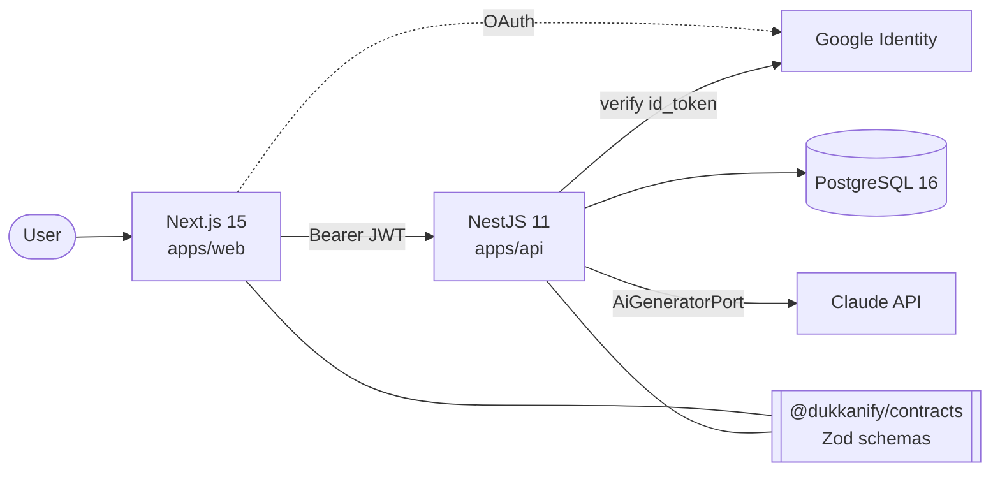
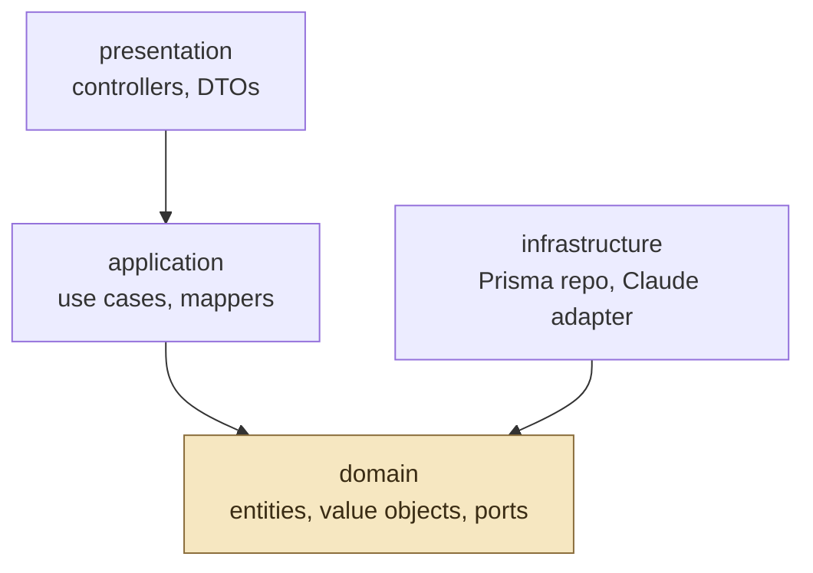
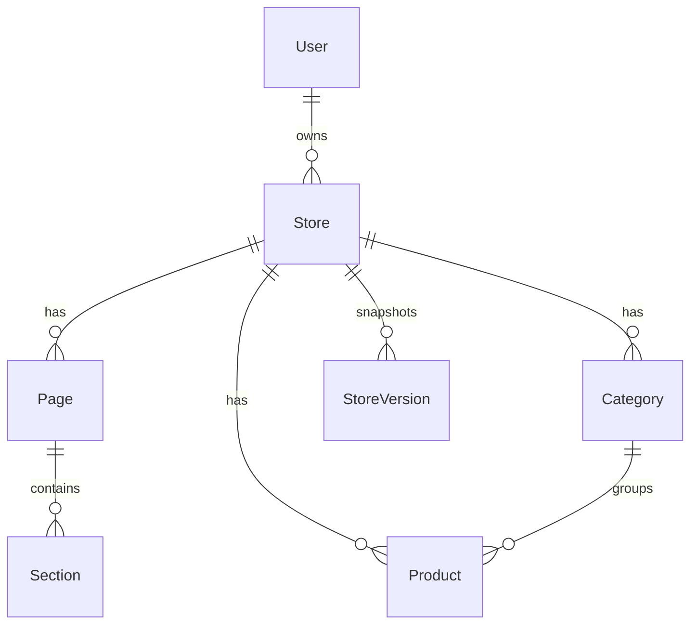
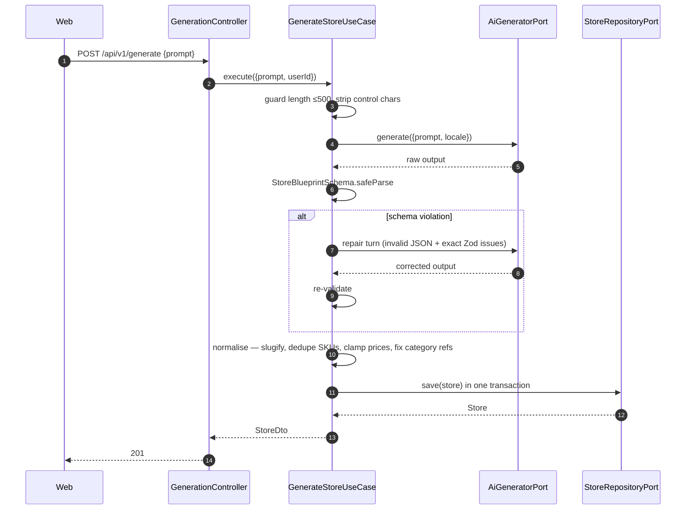
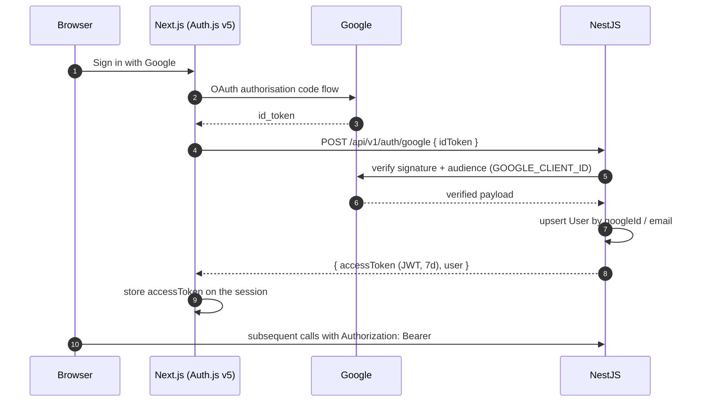

# Architecture — Dukkanify AI Store Builder

> This document is written **before** the code. Claude Code reads it on every task, so
> it functions as the specification; at the end of the build the README is generated
> from it. If an implementation ever disagrees with this file, one of the two is wrong —
> fix it, don't let them drift.

**Build constraint:** one-day sprint (~12 hours). Every decision below optimises for
*the layer that is expensive to change later* — the domain model, the provider
boundary, and the shared contract. Feature breadth is deliberately sacrificed;
see [Known limitations](#14-known-limitations).

---

## 1. System context



Three deployables, one shared type package. The web app never talks to Postgres or to
Claude — it only knows the API. That single rule is what keeps the AI key out of the
browser bundle and makes the backend independently testable.

---

## 2. Repository layout

```
dukkanify/
├── apps/
│   ├── web/                  Next.js 15, App Router
│   └── api/                  NestJS 11
├── packages/
│   ├── contracts/            Zod schemas → inferred types → JSON Schema
│   └── tsconfig/             strict base config both apps extend
├── docs/
│   ├── architecture.md       this file
│   └── prompts.md            every prompt used, and what was changed afterwards
├── docker-compose.yml
├── CLAUDE.md                 engineering rules, auto-loaded by Claude Code
└── README.md                 generated at the end, from this file
```

npm workspaces, no Turborepo. Turbo is build caching, not architecture; on a 12-hour
build it costs setup time and buys nothing.

---

## 3. The dependency rule



Arrows point **inward, always**. Concretely:

- `domain/` imports nothing from `@nestjs/*`, `@prisma/client`, or `@anthropic-ai/sdk`
- `application/` depends on **ports** (interfaces), never on implementations
- `infrastructure/` implements ports and is the only place framework libraries appear
- `presentation/` validates input, calls a use case, maps the result out

The verification, run before every push:

```bash
grep -rn "PrismaService\|@prisma/client\|@anthropic-ai/sdk" \
  apps/api/src/modules/*/domain apps/api/src/modules/*/application
```

**Zero hits or the layering is decorative.** This is the single check that separates a
folder structure that *looks* like clean architecture from one that is.

---

## 4. Backend structure

Three modules. Resist a fourth.

```
apps/api/src/
├── main.ts                       helmet, cors, /api/v1, global pipe + filter, swagger
├── app.module.ts
├── config/{configuration.ts,env.validation.ts}
├── common/
│   ├── errors/                   DomainError + NotFoundError, ForbiddenError, ValidationError
│   ├── filters/all-exceptions.filter.ts
│   ├── interceptors/{logging,transform}.interceptor.ts
│   └── decorators/{current-user,public}.decorator.ts
├── infrastructure/prisma/{prisma.module.ts,prisma.service.ts}
└── modules/
    ├── auth/                                     thin — no domain layer needed
    │   ├── application/auth.service.ts
    │   ├── infrastructure/{google-token.verifier.ts,jwt.strategy.ts,jwt-auth.guard.ts}
    │   └── presentation/auth.controller.ts
    ├── stores/
    │   ├── domain/
    │   │   ├── entities/{store,page,section,product}.entity.ts
    │   │   ├── value-objects/{slug.vo.ts,money.vo.ts}
    │   │   └── ports/store.repository.port.ts    interface + STORE_REPOSITORY token
    │   ├── application/
    │   │   ├── use-cases/{get-store,list-stores,update-section}.use-case.ts
    │   │   ├── dto/
    │   │   └── mappers/store.mapper.ts
    │   ├── infrastructure/prisma-store.repository.ts
    │   └── presentation/stores.controller.ts
    └── generation/
        ├── domain/ports/ai-generator.port.ts     interface + AI_GENERATOR token
        ├── application/
        │   ├── use-cases/generate-store.use-case.ts
        │   └── services/blueprint-repair.service.ts
        ├── infrastructure/
        │   ├── providers/{mock,claude}.generator.ts
        │   └── prompts/{system,user}.prompt.ts, prompt.version.ts
        └── presentation/generation.controller.ts
```

`auth/` has no `domain/` folder on purpose — it holds no business rules, only token
verification. Inventing an empty domain layer to look symmetrical is cargo cult;
say so if asked.

### Port bindings

```ts
// stores.module.ts
{ provide: STORE_REPOSITORY, useClass: PrismaStoreRepository }

// generation.module.ts — provider chosen by config, not by import
{
  provide: AI_GENERATOR,
  inject: [AppConfig],
  useFactory: (cfg: AppConfig) =>
    cfg.ai.provider === 'claude' ? new ClaudeGenerator(cfg) : new MockGenerator(),
}
```

---

## 5. Frontend structure

```
apps/web/src/
├── app/
│   ├── layout.tsx                       next/font, dir attribute from store locale
│   ├── (marketing)/page.tsx             landing — Server Component
│   ├── (auth)/login/page.tsx
│   ├── (dashboard)/layout.tsx           session guard, shell
│   ├── (dashboard)/dashboard/page.tsx   "Welcome Abdullah" + Create Store
│   ├── (dashboard)/builder/[storeId]/page.tsx
│   ├── preview/[slug]/page.tsx          public storefront
│   └── api/auth/[...nextauth]/route.ts
├── features/
│   ├── generation/{prompt-composer.tsx,actions.ts}
│   ├── builder/{editor-panel.tsx,builder-store.ts}
│   └── storefront/
│       ├── section-renderer.tsx         registry + exhaustive never check
│       └── sections/{hero,category-grid,product-grid,rich-text,contact}.section.tsx
├── components/ui/                       shadcn only, never hand-edited
└── lib/{api-client.ts,auth.ts,utils.ts}
```

Server Components by default. `"use client"` appears only on leaf interactive
components: the prompt composer, the editor panel, the device toggle. The storefront
sections stay server-rendered in the public route and are reused client-side inside
the builder — **one set of components, two contexts**.

### Section renderer registry

```ts
type SectionProps = { content: SectionContent; theme: ThemeTokens };

const SECTION_REGISTRY: Record<SectionType, ComponentType<SectionProps>> = {
  HERO: HeroSection,
  CATEGORY_GRID: CategoryGridSection,
  PRODUCT_GRID: ProductGridSection,
  RICH_TEXT: RichTextSection,
  CONTACT: ContactSection,
};

export function SectionRenderer({ section, theme }: Props) {
  const Component = SECTION_REGISTRY[section.type];
  if (!Component) {
    const _exhaustive: never = section.type;   // compile error if an enum member is unhandled
    return null;
  }
  return <Component content={section.content} theme={theme} />;
}
```

Adding a section type is: one enum value in contracts, one component file, one registry
line. The `never` assignment makes forgetting the component a **compile error**, not a
runtime blank space. This is the design the 15-minute live-coding round will exercise.

---

## 6. Data model



```prisma
generator client { provider = "prisma-client-js" }
datasource db    { provider = "postgresql", url = env("DATABASE_URL") }

model User {
  id        String   @id @default(cuid())
  email     String   @unique
  name      String?
  avatarUrl String?
  googleId  String?  @unique
  stores    Store[]
  createdAt DateTime @default(now())
}

model Store {
  id         String         @id @default(cuid())
  ownerId    String
  owner      User           @relation(fields: [ownerId], references: [id], onDelete: Cascade)
  name       String
  slug       String         @unique
  tagline    String?
  prompt     String                                  // the original natural-language request
  promptVersion String                               // PROMPT_VERSION used to generate it
  status     StoreStatus    @default(DRAFT)
  locale     String         @default("en")
  direction  Direction      @default(LTR)
  theme      Json                                    // ThemeTokens, Zod-validated at the app layer
  pages      Page[]
  categories Category[]
  products   Product[]
  versions   StoreVersion[]
  createdAt  DateTime       @default(now())
  updatedAt  DateTime       @updatedAt

  @@index([ownerId, createdAt])                      // dashboard: my stores, newest first
}

model Page {
  id       String    @id @default(cuid())
  storeId  String
  store    Store     @relation(fields: [storeId], references: [id], onDelete: Cascade)
  type     PageType
  title    String
  slug     String
  position Int
  sections Section[]

  @@unique([storeId, slug])                          // one /about per store
}

model Section {
  id       String      @id @default(cuid())
  pageId   String
  page     Page        @relation(fields: [pageId], references: [id], onDelete: Cascade)
  type     SectionType
  position Int
  content  Json                                      // discriminated union, Zod-validated

  @@index([pageId, position])                        // ordered render of a page
}

model Category {
  id       String    @id @default(cuid())
  storeId  String
  store    Store     @relation(fields: [storeId], references: [id], onDelete: Cascade)
  name     String
  slug     String
  position Int
  products Product[]

  @@unique([storeId, slug])
}

model Product {
  id          String    @id @default(cuid())
  storeId     String
  store       Store     @relation(fields: [storeId], references: [id], onDelete: Cascade)
  categoryId  String?
  category    Category? @relation(fields: [categoryId], references: [id], onDelete: SetNull)
  name        String
  description String
  price       Decimal   @db.Decimal(10, 2)
  currency    String    @default("AED")
  sku         String
  imageUrl    String?

  @@unique([storeId, sku])                           // SKU unique per tenant, not globally
  @@index([storeId, categoryId])                     // category-filtered product grid
}

model StoreVersion {
  id        String   @id @default(cuid())
  storeId   String
  store     Store    @relation(fields: [storeId], references: [id], onDelete: Cascade)
  label     String
  snapshot  Json
  createdAt DateTime @default(now())

  @@index([storeId, createdAt])
}

enum StoreStatus { DRAFT PUBLISHED }
enum Direction   { LTR RTL }
enum PageType    { HOME ABOUT CONTACT }
enum SectionType { HERO CATEGORY_GRID PRODUCT_GRID RICH_TEXT CONTACT }
```

Notes worth defending out loud:

- **`Decimal(10,2)`, never `Float`.** Binary floating point cannot represent 19.99.
- **`locale` and `direction` exist from migration one.** RTL is a data property, not a
  CSS afterthought. Costs two columns; proves the Arabic requirement was designed for.
- **`StoreVersion` is defined but unwritten.** Schema ready, writer out of scope — stated
  honestly in Known limitations rather than hidden.
- **JSON for `theme` and `content`.** Section shapes evolve constantly; a table per
  section type would mean a migration per design change. Type safety is recovered at
  the application boundary by Zod, which is where it belongs for polymorphic content.
- **`onDelete: Cascade`** everywhere a child cannot exist alone; `SetNull` on
  `Product.category` because a product outlives its category.

---

## 7. AI generation pipeline



### Why each piece exists

**The provider is a port.** The two volatile dependencies in this product are the model
vendor and the database. Both sit behind interfaces owned by the domain, so swapping
Claude for Gemini is one new file in `infrastructure/providers/` plus one factory line —
zero use cases touched.

**One schema, three jobs.** `StoreBlueprintSchema` (Zod) is converted with
`zod-to-json-schema` into the tool `input_schema` sent to the model, validates the
response, and its inferred type is what React renders. Prompt and validator **cannot**
drift, because there is only one definition.

**A repair turn, not a retry.** Blind retry re-rolls the same failure mode. Feeding back
the exact Zod issues gives the model the information it was missing. Two attempts
total, then a typed `422` with an actionable message — never a `500`, because a
contract violation is not a server fault.

**Deterministic post-processing.** Slugs, SKU de-duplication, 2-decimal price clamping
and category-reference repair happen in the use case. Never ask a language model to
guarantee what code can guarantee.

**Prompts are versioned.** `PROMPT_VERSION` is written to every `Store` row, so output
quality is attributable to a specific prompt revision. This is what makes prompt
changes measurable rather than vibes.

**A mock provider ships alongside the real one.** `MockGenerator` is deterministic and
keyword-driven. It makes the entire frontend developable offline at zero cost, and it
makes the use case unit-testable without a network. It is not a stub for missing work —
it is the test double the architecture was designed to allow.

**Model:** `claude-sonnet-5`, `max_tokens` from config, 60s timeout via `AbortController`.
Logged per call: latency, token counts, `PROMPT_VERSION`. Never logged: the API key,
the full prompt body.

---

## 8. Authentication



One identity provider, one application token, both apps agreeing on it. The Google
token is verified **server-side** against the client ID — a frontend check proves
nothing, since anything the browser asserts is attacker-controlled.

Ownership is enforced **inside the use case**, not the controller. A guard proves *who*
you are; only the use case knows whether this user may touch this store. Putting it in
the controller means every new route has to remember — putting it in the use case means
it cannot be bypassed.

---

## 9. API surface

| Method | Path | Auth | Purpose |
|---|---|---|---|
| `POST` | `/api/v1/auth/google` | public | Exchange Google `id_token` for an application JWT |
| `POST` | `/api/v1/generate` | required, 5/min/user | Generate and persist a store from a prompt |
| `POST` | `/api/v1/store` | required | Persist or update a store the client holds |
| `GET` | `/api/v1/store` | required | List the current user's stores |
| `GET` | `/api/v1/store/:id` | required + ownership | Full store with pages, sections, products |
| `PATCH` | `/api/v1/store/:id/sections/:sectionId` | required + ownership | Inline editor update |
| `GET` | `/api/v1/storefront/:slug` | public | Published storefront render data |
| `GET` | `/api/v1/health` | public | Liveness + database connectivity |

URI versioning at `/api/v1`. Every response wrapped by `TransformInterceptor` as
`{ data, meta }`. Swagger at `/api/docs` outside production.

---

## 10. Error model

Application code throws `DomainError` subclasses; it never throws `HttpException`.
`AllExceptionsFilter` performs the single mapping to HTTP:

| Thrown | Status | When |
|---|---|---|
| `ValidationError` | 400 | Input failed a domain invariant |
| `UnauthorizedError` | 401 | Missing or invalid token |
| `ForbiddenError` | 403 | Authenticated but not the owner |
| `NotFoundError` | 404 | Store or section does not exist for this owner |
| `BlueprintGenerationFailedError` | 422 | Model output failed the contract twice |
| `AiProviderUnavailableError` | 503 | Upstream timeout or network failure |
| anything else | 500 | Logged with requestId; no stack trace in production |

Keeping HTTP out of the application layer is what allows the same use cases to be
driven later by a queue worker or a CLI without rewriting them.

---

## 11. Theming and RTL

The model returns theme tokens; they become CSS custom properties on a wrapper element:

```tsx
<div style={{
  '--brand-primary': theme.colors.primary,
  '--brand-bg': theme.colors.background,
  '--brand-radius': theme.radius,
} as CSSProperties}>
```

Section components reference `var(--brand-*)` **only** — never a hardcoded colour. Live
colour editing therefore needs no re-render logic, no recompile, and no theme provider.

RTL works because of two rules held from the first commit: `Store.direction` is a
column, and every spacing utility is logical (`ms-*`, `me-*`, `ps-*`, `pe-*`,
`start-*`, `end-*`) rather than physical (`ml-*`, `pl-*`). Flipping direction is one
attribute; no layout code changes. That is why the live-coding "add RTL support" task
takes minutes rather than an afternoon.

---

## 12. Configuration

Validated with Zod at boot. `process.env` is read in exactly one file; everything else
injects a typed `AppConfig`. A missing variable fails startup with a readable list —
not a `undefined` three layers deep at request time.

| Variable | App | Purpose |
|---|---|---|
| `DATABASE_URL` | api | PostgreSQL connection string |
| `PORT`, `NODE_ENV`, `CORS_ORIGIN` | api | Server basics |
| `AI_PROVIDER` | api | `mock` \| `claude` — selects the adapter bound to `AI_GENERATOR` |
| `ANTHROPIC_API_KEY` | api | Never exposed to the browser |
| `AI_MODEL`, `AI_MAX_TOKENS` | api | Default `claude-sonnet-5` |
| `JWT_SECRET`, `JWT_EXPIRES_IN` | api | Application token signing |
| `GOOGLE_CLIENT_ID` | api | Audience for server-side `id_token` verification |
| `THROTTLE_TTL`, `THROTTLE_LIMIT` | api | Rate limiting |
| `NEXT_PUBLIC_API_URL` | web | API base URL — the only public variable |
| `AUTH_SECRET` | web | Auth.js session encryption |
| `AUTH_GOOGLE_ID`, `AUTH_GOOGLE_SECRET` | web | Google OAuth client |

---

## 13. Testing strategy

Deliberately narrow, chosen for signal per minute on a one-day build:

| Layer | Tested | How |
|---|---|---|
| Contracts | Blueprint schema accepts a valid fixture, rejects wrong product count, bad hex, orphan category | vitest, pure |
| Domain | Entity invariants (slug shape, page count, positive price) | vitest, no framework |
| Application | `GenerateStoreUseCase` against `MockGenerator` + in-memory repository fake | vitest, no network, no database |
| Infrastructure | Claude adapter with the SDK mocked: happy path, malformed JSON, schema violation, network error | vitest |

Not covered: HTTP e2e, repository integration against real Postgres, frontend
component tests. Listed in Known limitations — those are the first things a second day
would buy.

The use cases being testable with zero infrastructure is not a coincidence; it is the
direct payoff of the dependency rule in §3.

---

## 14. Known limitations

Accurate as of submission. Nothing below is implied to work elsewhere in the repo.

- **Bonus features not implemented:** SSE streaming, undo/redo, version history writer.
  `StoreVersion` exists in the schema with no producer.
- **Gemini adapter not written.** The port exists and the factory branches on config;
  the adapter is one file. This is the point of the port, not an oversight.
- **Product imagery is deterministic placeholder generation.** No image model wired in.
- **No HTTP e2e or repository integration tests.** Unit coverage only, as scoped in §13.
- **Single-region, single-instance deployment.** No cache layer, no read replicas.
- **Arabic generation works but is untested end to end.** RTL layout is verified; the
  quality of generated Arabic copy is not measured.
- **No image upload, no publishing to a custom domain, no billing.** Out of scope.

---

## 15. Scaling to 100,000 stores

1. **Reads dominate, and they are cacheable.** Published storefronts are static per
   version: Next ISR with `revalidateTag('store:' + id)` on save, plus Redis in front of
   `findBySlug`. Postgres read replicas serve public traffic; the primary handles builder
   writes only.
2. **Generation is the bottleneck, not the database.** It is slow, expensive and
   rate-limited upstream. Move `POST /generate` behind a BullMQ queue with per-user
   concurrency caps and idempotency keys, return `202` with a job id, and report progress
   over SSE. Workers then scale independently of the API. Because the use case depends
   only on ports, the queue worker calls the *same* class — no rewrite.
3. **The data shape holds.** 100k stores × ~15 sections ≈ 1.5M section rows: comfortable
   for Postgres with `@@index([pageId, position])`. Beyond that, partition `Section` and
   `Product` by `storeId` hash. JSONB stays queryable via GIN if content search is needed.
4. **Tenant isolation is already single-source.** Every query is scoped by `ownerId`
   inside `PrismaStoreRepository`, so Postgres row-level security is a later drop-in
   rather than an audit of every call site.
5. **Assets** move to S3 + CloudFront; blueprints store keys, not URLs.
6. **Observability that predicts user pain:** OpenTelemetry spans around the AI call,
   with p95 generation latency and schema-failure rate **per `PROMPT_VERSION`** as the SLIs.

## 16. Two-week refactoring roadmap

**Week 1 — correctness and confidence**
- Publish `@dukkanify/contracts` as a versioned package with contract tests both apps run in CI
- Replace thrown errors in application code with `Result<T, DomainError>`; reserve exceptions for infrastructure
- Integration tests with Testcontainers so repository adapters run against real Postgres
- Move generation onto the queue (unblocks §15.2)

**Week 2 — evolution**
- Domain events (`StoreGenerated`, `StorePublished`) via a transactional outbox
- Extract storefront rendering into its own edge-deployed app so public traffic never touches the builder
- Feature-flagged prompt versions with side-by-side quality scoring
- Full Arabic generation as a tested first-class path, not a toggle

---

## 17. Decision record

| # | Decision | Alternative rejected | Reason |
|---|---|---|---|
| 1 | npm workspaces monorepo | Two repos | The shared contract is the point; two repos means duplicated types and version skew on day one |
| 2 | No Turborepo | Turborepo | Build caching, not architecture. Setup cost buys nothing in 12 hours |
| 3 | Zod contract package | Types in each app | One definition serving prompt schema, API validation and UI types is what makes the AI boundary safe |
| 4 | Ports for AI and persistence | Inject `PrismaService` / SDK directly | These are the two volatile dependencies; both must be swappable without touching use cases |
| 5 | Mock generator shipped | Only the real provider | Enables offline development, zero-cost iteration, and unit tests without a network |
| 6 | Repair turn on schema failure | Blind retry, or accept partial output | Retry re-rolls the same failure; partial output corrupts the database |
| 7 | JSON columns for theme/content | A table per section type | Section shapes change constantly; a migration per design tweak is untenable. Zod restores safety at the boundary |
| 8 | `Decimal(10,2)` | `Float` | Floating point cannot represent currency |
| 9 | Ownership check in use case | In the controller or a guard | A guard knows who you are, not what you may touch. In the use case it cannot be bypassed by a new route |
| 10 | Token exchange server-side | Trust the Google token in the frontend | Anything the browser asserts is attacker-controlled |
| 11 | CSS custom properties for theming | Tailwind config / theme provider | The AI generates arbitrary palettes at runtime; a compile-time theme cannot express that |
| 12 | Section registry with `never` check | Switch statement | Makes an unhandled section type a compile error and reduces a new section to three lines |
| 13 | Bonuses cut, cuts documented | Ship partial bonuses | A complete core with an honest gap list is worth more than four half-built features |